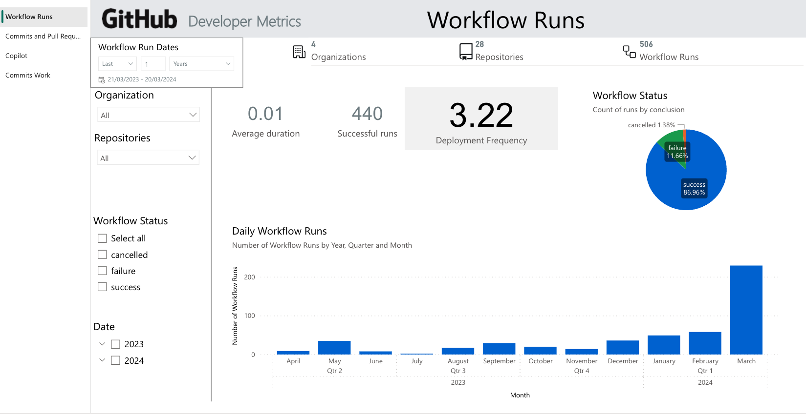

# GitHub Developer Metrics - Copilot Impact

This repository contains dashboards and report templates for reporting developer-related metrics. The metrics are derived from data available within the GitHub platform, providing a comprehensive view of the development process.

## Overview

The project uses Power BI for data visualization, showcasing metrics around commits, pull requests, and CI/CD workflow runs. It also includes metrics related to GitHub Copilot, comparing the before and after figures to showcase the impact and value of Copilot in the development process.

## Structure

The repository is structured as follows:

- `src/github.Dataset`: This directory contains the dataset definitions and model for the metrics.
- `src/github.Report`: This directory contains the report definitions and configurations.
- `api.github.com.pbids`, `github.pbit`, `src/github.pbip`: These files are related to Power BI and are used for data visualization.

## Setup

To use this report, you need to have Power BI Desktop installed or the Power BI online service. There are two options.

### Option 1 - Install the Power BI App from AppSource

You can install from the AppSource. This will launch the app installation wizard in the Power BI service, taking you through the setup questions.

### Option 2 - Install the Power BI App from a template file

Download and open the [Power BI template](/github.pbit) `.pbit` file in Power BI Desktop and connect to your GitHub data source.

After opening the .pbit file, Power BI will prompt you to enter the parameters defined in the template.
Once you've entered the parameters, the report will load with your data.
You can then customize the reports to suit your needs and consume locally. Alternatively, you can [publish](https://learn.microsoft.com/en-us/power-bi/create-reports/desktop-upload-desktop-files) the report to your workspace in Power BI service.

### What you need to begin

The report makes use of the following parameters:
| Parameter | |
| --- | --- |
| Name | OrganizationList |
| Description | Comma-separated list of GitHub organizations to report on |
| Type | Text |
| Required | True |

### Authentication

> [!IMPORTANT]
> To connect to your GitHub data, the integration requires authentication and authorisation. For authentication, select `Basic` authentication and supply your username and password.

| Authentication | |
| --- | --- |
| Type | Basic |
| Username | _provide your username_ |
| Password | _provide your PAT token_ |
| Privacy Level | Organization |

### Authorization

Create a `classic` personal access token (PAT). For more information on how to create PATs, follow the [GitHub documentation](https://docs.github.com/en/authentication/keeping-your-account-and-data-secure/managing-your-personal-access-tokens#creating-a-personal-access-token-classic).

You will need to set up the following permissions and scopes:
| Scope | Permissions |
| --- | --- |
| workflow | |
| admin:org | read:org |
| user | read:user |
| | user:email |
| admin:enterprise | read:enterprise |
| copilot | manage_billing:copilot |
| project | read:project |
| repo | repo:status |
| | repo_deployment |
| | public_repoAccess public repositories |
| | repo:inviteAccess repository invitations |
| | security_events |

> [!NOTE]
> To read Copilot data, you need to be an organization admin.

## Contributing

Contributions to this project are welcome. Please open an issue to discuss your proposed changes or submit a pull request.

## License

This project is licensed under the terms of the MIT license.
